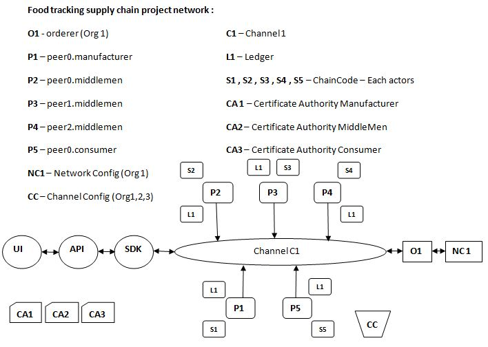

# SupplyChain - HLF project :

# Members :

1.  Dwij Amin
2.  Smit Patel
3.  Karan Acharya
4.  Kotadiya Piyush

## Objective :

In the traditional supply chain models, the information about an entity is not fully transparent to others, which leads to inaccurate reports and a lack of interoperability. Emails and printed documents provide certain information, but still can’t contain fully detailed visibility and traceability information since the products across the entire supply chain are hard to trace. It is almost impossible for the consumer to know the true value of the product they purchased.
Since the blockchain is a transparent, immutable, and secure decentralized system, it is considered to be a game-changing solution for traditional supply chain industries. It can help to build an effective supply chain system by improving the following areas:

          * Tracking the products in the entire chain
          * Verifying and authenticating the products in the chain
          * Sharing the entire chain information between supply chain actors
          * Providing better auditability

## Use case :

- Farm to fork tracking
- Diamond tracking
- High priced goods such as Leather goods , watches , dresses etc.

## Components Developed :

- Frontend app with React.js
- Middleware APIs using Node
- Node.js for SDK
- Network - Hyperledger Fabric
- Chaincode - GoLang

## Users in this Application :

- Manufacture
- WholeSeller
- Distributor
- Retailer
- Consumer

## Application Architecture :

## Application Flow :

- Users are enrolled into the application by an Admin.
- New Products will be created by the Manufacturer only.
- Then Product will be sent to WholeSeller
- Wholesalers will send the product to the Distributor.
- Distributor will send it to Retailer
- Consumer could place the order
- Consumer will mark as Delivered once the product is delivered

## Fabric Network details :

- Three Orgs (Manufacturer/MiddleMen/Consumer)
- Five peers
- One Orderer (Org1)
- One Channel
- Three Certificate Authority (Each org 1 CA)
- Fabric network implemented with Fabric CA as certificate authority.

## Chaincode Functions :

- createUser (Admin)
- signIn (user Login)
- createProduct: ( Manufacturer)
- updateProduct (Manufacturer,Wholesaler,Distributor,Retailer)
- sendToWholesaler
- sendToDistributor
- sendToRetailer
- sellToConsumer
- QueryAsset (Query by Product ID)
- QueryAll (All )
- orderProduct(Consumer places order , productID -> Retailer)
- deliveredProduct (Retailer Updates)
- Init - Initialize Counters to NIL
- Invoke - To invoke each function in the chaincode

## Planned APIs :

- User SignIn
- createProduct
- sendToWholesealer
- sendToDistributor
- sendToRetailer
- sellToCustomer
- Update product
- Email Notification service for above APIs

# Steps to up the network using shell scripts :

1.  sudo docker ps --all
2.  ./stopNetwork.sh
3.  ./teardown.sh
4.  ./operate.sh up

# Steps to run the API server

cd web-app/servers/

npm install

nodemon app.js
